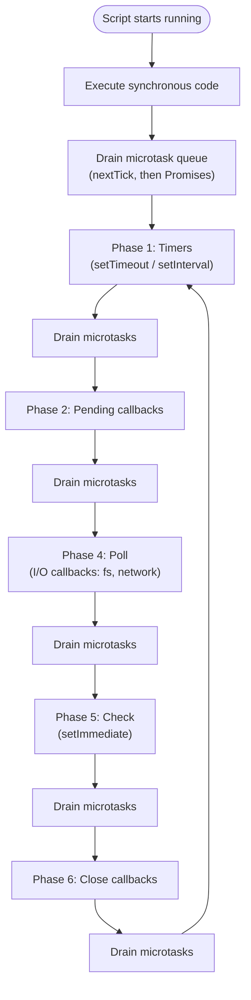

# Backend Principles

Notes and reference material on core backend concepts.

---

## Event Loop

### What it is

JavaScript runs on a **single thread**. Only one piece of code can execute at any given moment. The **event loop** is the mechanism that allows Node.js to handle asynchronous operations (I/O, timers, network calls) **without blocking** that single thread — by delegating slow work elsewhere and scheduling callbacks to run once the work is done.

It's not a separate thread you "turn on." It's part of the Node.js runtime and starts automatically the moment a script runs. What you control is *how* your code uses it: whether you write blocking synchronous code or non-blocking asynchronous code.

### Why it exists

Node was designed to handle many concurrent connections (servers, APIs) on a single thread. Without an event loop, any I/O operation (reading a file, querying a database, waiting on a network response) would freeze the entire process until it finished — meaning one slow request could stall every other user.

Instead, Node delegates I/O work to the underlying system (**libuv**, which uses its own thread pool internally for things like file access), keeps the main thread free, and uses the event loop to pick up finished work and run its callback when the thread becomes available again.

### The six phases

Each full cycle of the event loop passes through six phases, in order. Each phase has its own FIFO queue of pending callbacks:

| # | Phase | What runs here |
|---|---|---|
| 1 | **Timers** | Callbacks from `setTimeout()` / `setInterval()` whose delay has elapsed |
| 2 | **Pending callbacks** | Certain deferred system-level callbacks (e.g. some TCP errors) |
| 3 | **Idle, prepare** | Internal use only — not relevant to application code |
| 4 | **Poll** | Most I/O callbacks (file reads, network data); the loop also waits here if nothing else is ready |
| 5 | **Check** | Callbacks from `setImmediate()` |
| 6 | **Close callbacks** | Close events, e.g. `socket.on('close', ...)` |

After completing phase 6, the loop returns to phase 1 and repeats — for as long as the process has pending work.

### Microtasks: the priority lane

Microtasks don't have their own phase. Instead, they run in the gap **after every single task finishes on the main thread** — whether that task is the initial script, a timer callback, an I/O callback, or anything else.

Two microtask queues exist, drained in this priority order:

1. `process.nextTick()` — highest priority
2. Resolved Promises (`.then()`, `async/await`) and `queueMicrotask()`

Both queues are drained **completely** before the event loop is allowed to move on to its next task — even if new microtasks get added while draining.

### Diagram



### Key example

```js
console.log("1: sync");

setTimeout(() => console.log("2: setTimeout"), 0);

Promise.resolve().then(() => console.log("3: promise.then"));

process.nextTick(() => console.log("4: nextTick"));

console.log("5: sync");
```

Output:

```
1: sync
5: sync
4: nextTick
3: promise.then
2: setTimeout
```

All synchronous code runs first as a single unit. Once the call stack is empty, microtasks drain completely (`nextTick` before Promises). Only then does the loop move into the **Timers** phase, where the `setTimeout` callback finally fires.

### What blocks the event loop

The event loop can only act **between tasks** — it cannot interrupt code that's currently running. This means:

- **Blocking I/O** (e.g. `fs.readFileSync` on a server) freezes the thread for the duration of the operation.
- **Heavy synchronous CPU work** (e.g. a deep recursive calculation, a massive loop) freezes the thread the same way, even if it doesn't touch I/O at all — wrapping it in a `Promise` or `async` function does **not** fix this, since the computation itself never yields control.

```js
// Blocks everything for ~3 seconds — no other request can be served meanwhile
function blockingTask() {
  const start = Date.now();
  while (Date.now() - start < 3000) {}
}
```

For genuine CPU-bound work, the fix isn't "more async syntax" — it's moving the work off the main thread entirely with `worker_threads` (or `child_process`, or an external job queue for larger-scale, persistent workloads).

### Summary

- The event loop is a **scheduler**, not a parallel execution engine — there's still only one thread running your JS code.
- **I/O is delegated** to the system (libuv); the main thread is freed up while waiting.
- **Microtasks** (`nextTick`, Promises) always run before the next macrotask (timers, I/O callbacks, `setImmediate`), in the gap right after the current task finishes.
- **Synchronous blocking code — I/O or CPU — stalls the entire process**, regardless of how many other requests are waiting.